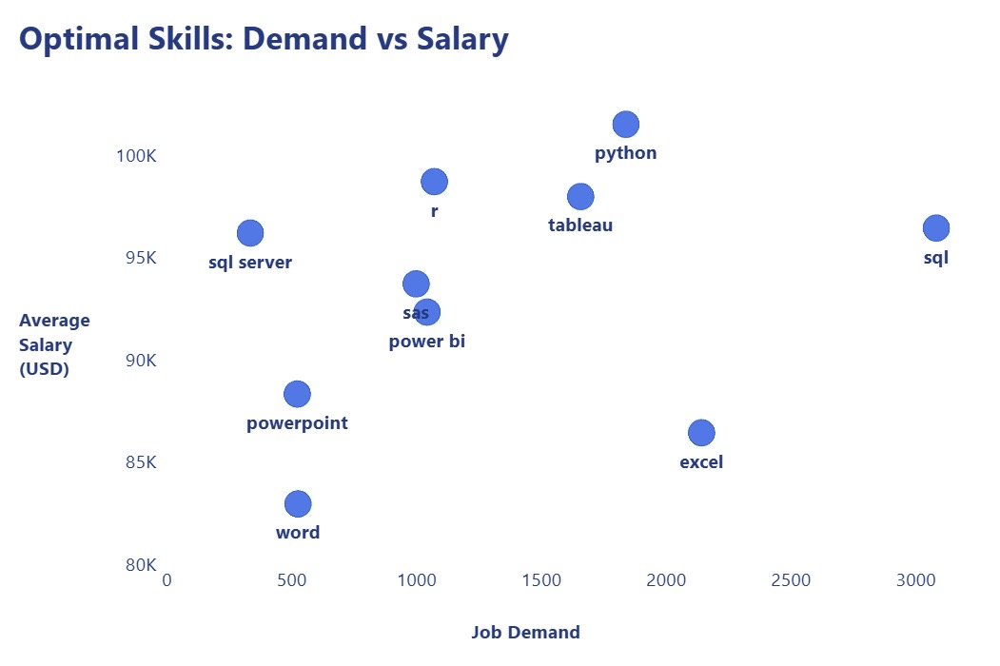

# SQL Data Analyst Job Market Analysis

## 📌 Introduction

This project analyzes the **Data Analyst job market** using **SQL** and **Power BI**. The analysis is based on real-world job posting data and focuses on answering practical career questions that are valuable for aspiring data analysts.

The project explores:

- Which Data Analyst jobs offer the highest salaries?
- Which companies hire the most Data Analysts?
- What skills are most in demand?
- Which job platforms publish the most Data Analyst positions?
- Which skills provide the best balance between market demand and salary?

This project demonstrates practical SQL querying, data analysis, and dashboard visualization skills commonly used in real-world data analyst roles.

---

# 🛠 Tools Used

- **PostgreSQL** – Data querying and analysis
- **SQL** – Data extraction and aggregation
- **Power BI** – Dashboard visualization
- **Visual Studio Code** – SQL development
- **Git & GitHub** – Version control and project documentation

---

# 📊 Analysis

## Query 1 – Top Paying Data Analyst Jobs

### Business Question

Which remote Data Analyst jobs offer the highest annual salaries?

### SQL File

`project_sql/1_top_paying_jobs.sql`

### Dashboard


### Key Insights

- The highest-paying Data Analyst position offers an annual salary above **$650,000**.
- Most top-paying positions are senior or director-level roles.
- Remote opportunities dominate the highest salary range.

---

## Query 2 – Top Companies Hiring Data Analysts

### Business Question

Which companies publish the largest number of Data Analyst job postings?

### SQL File

`project_sql/2_top_hiring_companies.sql`

### Dashboard


### Key Insights

- A small number of companies account for a significant share of Data Analyst openings.
- Large hiring companies may provide more opportunities for entry-level candidates.
- Hiring demand varies considerably across employers.

---

## Query 3 – Top 5 Most In-Demand Skills

### Business Question

Which skills appear most frequently in Data Analyst job postings?

### SQL File

`project_sql/3_top_demanded_skills.sql`

### Dashboard


### Key Insights

- **SQL** is the most frequently requested skill.
- **Excel** and **Python** remain essential for Data Analyst roles.
- **Tableau** and **Power BI** are widely required visualization tools.

---

## Query 4 – Top Job Platforms for Data Analyst Postings

### Business Question

Which job platforms publish the most Data Analyst positions?

### SQL File

`project_sql/4_top_job_platforms.sql`

### Dashboard


### Key Insights

- **LinkedIn** is the leading platform for Data Analyst job postings.
- **Indeed** and **ZipRecruiter** also contribute a significant number of opportunities.
- Different platforms serve different segments of the job market.

---

## Query 5 – Optimal Skills: Demand vs Salary

### Business Question

Which skills provide the best balance between market demand and average salary?

### SQL File

`project_sql/5_optimal_skills.sql`

### Dashboard



### Key Insights

- **SQL** offers the strongest combination of high demand and competitive salaries.
- **Python** and **Tableau** also provide excellent career opportunities.
- **SAS** commands the highest average salary but appears in relatively fewer job postings, indicating a niche specialization.

---

# 📈 Conclusions

This project demonstrates how **SQL** and **Power BI** can be combined to analyze real-world job market data.

### Main Findings

- SQL is the most valuable core skill for aspiring Data Analysts.
- Python and Tableau significantly improve career competitiveness.
- High salaries are concentrated in senior remote positions.
- LinkedIn is the dominant platform for Data Analyst job postings.
- Demand and salary should both be considered when choosing which technical skills to learn.

---

# 📂 Project Structure

```text
sql_project/
│
├── project_sql/
│   ├── 1_top_paying_jobs.sql
│   ├── 2_top_hiring_companies.sql
│   ├── 3_top_demanded_skills.sql
│   ├── 4_top_job_platforms.sql
│   └── 5_optimal_skills.sql
│
├── query_results/
│   ├── 1_top_paying_jobs.csv
│   ├── 2_top_hiring_companies.csv
│   ├── 3_top_demanded_skills.csv
│   ├── 4_top_job_platforms.csv
│   └── 5_optimal_skills.csv
│
├── images/
│   ├── 1_top_paying_jobs.jpg
│   ├── 2_top_hiring_companies.jpg
│   ├── 3_top_demanded_skills.jpg
│   ├── 4_top_job_platforms.jpg
│   └── 5_optimal_skills.jpg
│
└── README.md
```

---

# 👤 Author

**Mingyu Yang**

GitHub: https://github.com/mingyuuuuuuu